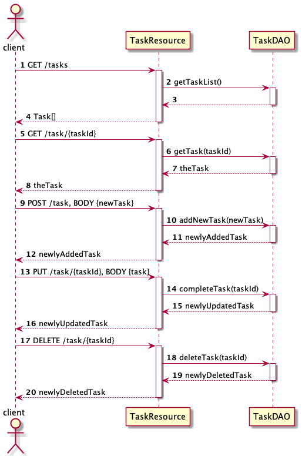
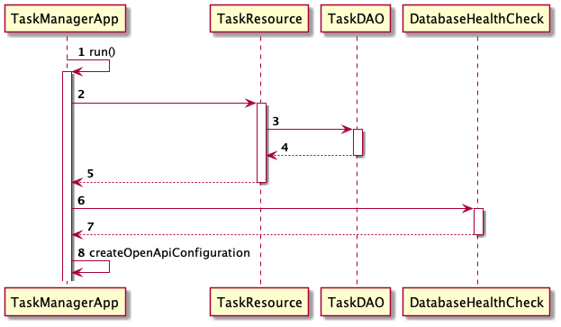
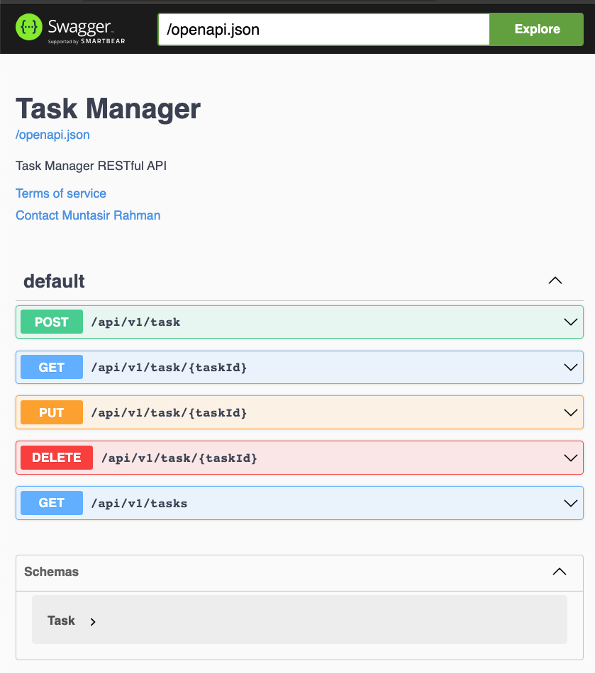

## Build and Run

```shell
mvn clean package
```
Then go to target directory, and execute the jar file.

```shell
cd target
java -jar task-server-1.0-SNAPSHOT.jar
```

### Launching the App using Docker
Build the Docker image, by typing this:
```shell
docker build -t taskman-api .
```

Run it by
```shell
docker run -p 8080:8080 taskman-api
```

### How It Works





To update this sequence diagram,
* install PlantUML plugin
* Edit the api-calls.puml and startup.puml files in the docs folder

### API Test and Documentation
The API also has OpenAPI documentation with Swagger-UI

[http://localhost:8080/docs](http://localhost:8080/docs)


## Tests

```shell
mvn clean test
```

To generate Test Report
```shell
mvn clean test site
```
The generated HTML files is at 
```shell
$PROJECT_ROOT/target/site
```


## Deployment

### Docker Image

Build the Docker image, by typing this:
```shell
docker build -t muntasir/taskman-api:amd64 -f Dockerfile.prod .
```

Then push it to the Docker hub
```shell
docker push muntasir/taskman-api:amd64
```

Check the presence of the newly uploaded docker image, by open this URL
[https://hub.docker.com/repository/docker/muntasir/taskman-api](https://hub.docker.com/repository/docker/muntasir/taskman-api)

At the deployment server
```shell
docker pull muntasir/taskman-api:amd64
```

To run it
```shell
docker run -p 8080:8080 muntasir/taskman-api:amd64
```
